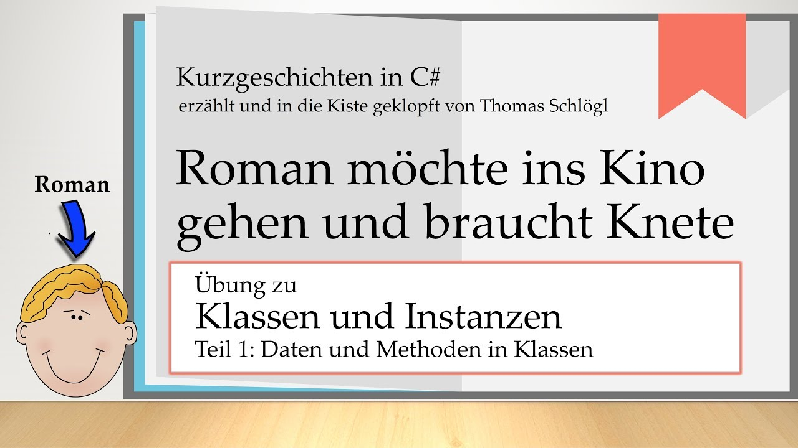
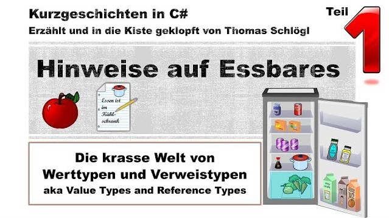

# Kurzgeschichten in C#

Das Repository enthält Programme die im Youtube Channel [Kurzgeschichten in C#](https://www.youtube.com/channel/UCMcHR9DBcGsbDtoZyZIFqoA) erstellt werden. Manchmal sind die Programme auch der Startpunkt für die Videos. Da die Lernvideos alle das Ziel verfolgen Jugendlichen und Junggebliebenen Hilfe beim Erlernen von C# zu geben, sind Variablen-, Klassen- und Methodennamen hauptsächlich in Deutsch, obwohl das in der professionellen Softwareentwicklung äußerst ungewöhnlich ist. Meiner Erfahrung nach, ist es für viele junge angehende Code Junkies durchaus hilfreich, Programme und deren Konzepte zunächst auf Deutsch vermittelt zu bekommen.

### Information in English
This repository contains programs of the youtube channel [Kurzgeschichten in C#](https://www.youtube.com/channel/UCMcHR9DBcGsbDtoZyZIFqoA) (engl. "Short stories in C#").
Please note that the channel is aiming to teach programming to young people. Not only the speech but also most code parts are in German. I am fully aware that this is very unusual in professional software development. But IMHO German names of classes, methods and variables are a great help for most young folks in understanding programs and their concepts.

# Videolinks und Programme in diesem Repository

|Solution|Was ist das für eine Solution?|Themen|Video (aufs Bild draufklicken)|
|:---:|:---:|:---:|:---:|
|001 Roman möchte ins Kino - mit Structs/Roman.sln|Das im Video erstellte Programm.|*Strukturen, statische Methoden*||
|002 Roman möchte ins Kino - mit Classes - 1/Roman.sln|Das im Video erstellte Programm.|*Klassen, Instanzvariablen*||
|003 Roman möchte ins Kino - mit Classes - 2/Roman.sln|Das im Video erstellte Programm.|*Klassen, private, Getter*||
|004 Hinweise auf Essbares - 1/Min15.sln|Wird im Video bei Minute 15 verwendet.|*int Variablen am Stack*||
|004 Hinweise auf Essbares - 1/Min21.sln|Wird im Video bei Minute 21 verwendet.|*Lokale char Variablen am Stack*||
|004 Hinweise auf Essbares - 1/Min25.sln|Wird im Video bei Minute 25 verwendet.|*Inputparameter am Stack bei Methodenaufrufen*||
|004 Hinweise auf Essbares - 1/Min33.sln|Wird im Video bei Minute 33 verwendet.|*ref Parameter am Stack bei Methodenaufrufen*||
|||||
