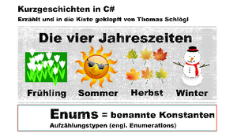

# Kurzgeschichten in C#

Hier findet man alle Programme die im Youtube Channel [Kurzgeschichten in C#](https://www.youtube.com/channel/UCMcHR9DBcGsbDtoZyZIFqoA) erstellt oder auch nur erklärt werden. 

**Warum ist der Code auf Deutsch?**
Da die Lernvideos alle das Ziel verfolgen Jugendlichen und Junggebliebenen Hilfe beim Erlernen von C# zu geben, sind Variablen-, Klassen- und Methodennamen hauptsächlich in Deutsch, obwohl das in der professionellen Softwareentwicklung äußerst ungewöhnlich ist. Ich habe mich trotzdem dazu entschieden, weil ich denke, dass es für viele junge angehende Code Junkies durchaus hilfreich ist. Die Umstellung auf Englisch zu einem späteren Zeitpunkt fällt dagegen vergleichsweise nicht schwer.

**Information for English visitors:**
This repository contains programs of my youtube channel [Kurzgeschichten in C#](https://www.youtube.com/channel/UCMcHR9DBcGsbDtoZyZIFqoA) (engl. "Short stories in C#"). Not only the videos, but also names of classes, methods and variables are in  (Austrian) German. The channel is aiming to teach programming to young fellows and those which are young at heart. IMHO it may give an easier start by using German.

**I am fully aware that this is very unusual for software developers.** But I think, switching later to English coding and commenting is comparatively simple anyway.

[Thomas Schlögl](https://www.linkedin.com/in/thomas-schl%C3%B6gl-b6692a142)

# Liste aller Programme der Videos

|Verzeichnis|Themen|Video (aufs Bild draufklicken)|
|:---|:---:|:---:|
|001 Roman möchte ins Kino - mit Structs| *Strukturen, statische Methoden*||
|002 Roman möchte ins Kino - mit Classes - 1|*Klassen, Instanzvariablen*||
|003 Roman möchte ins Kino - mit Classes - 2|*Klassen, private, Getter*||
|004 Hinweise auf Essbares - 1|int- und char-Variablen bei der Programmausführung am Stack und Heap||
|005 Hinweise auf Essbares - 2|*string-Variablen bei der Programmausführung am Stack und Heap*||
|006 Hinweise auf Essbares - 3|*Methodenaufrufe mit ref-Parametern vom Typ Array (Reference Type, Stack, Heap)*||
|007 From London to Tokyo|*GeoCoordinate, WebClient, Path, StreamReader, StreamWriter, String search*||
|008 TV Fernbedienung 1|*Delegates*||
|009 TV Fernbedienung 2|*Func, Action (bei 11:02 Reguläre Ausdrücke (RegEx) in Visual Studio)*||
|010 DateTime|*DateTime, TimeSpan*||
|011 Enums|*Enums*||
012 Linked Lists 1|*Einfach verkettete Listen: Grundlagen*||
013 Linked Lists 2|*Einfach verkettete Listen: Einfügen und ToString()*||
|014 Vererbung/Supermarkt|*Vererbung, Polymorphie*||
|015 Value Tuple|*Value Tuple*||
|016 Flaschen und Zahlen|*Speichern von Reference Types und Value Types bei der Programmausführung am Stack und Heap*||

# Have fun with all that stuff!