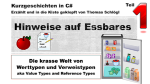
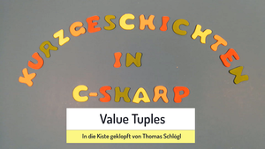

# Kurzgeschichten in C#

Das Repository enthält Programme die im Youtube Channel [Kurzgeschichten in C#](https://www.youtube.com/channel/UCMcHR9DBcGsbDtoZyZIFqoA) erstellt werden. Manchmal sind die Programme auch der Startpunkt für die Videos. Da die Lernvideos alle das Ziel verfolgen Jugendlichen und Junggebliebenen Hilfe beim Erlernen von C# zu geben, sind Variablen-, Klassen- und Methodennamen hauptsächlich in Deutsch, obwohl das in der professionellen Softwareentwicklung äußerst ungewöhnlich ist. Meiner Erfahrung nach, ist es für viele junge angehende Code Junkies durchaus hilfreich, Programme und deren Konzepte zunächst auf Deutsch vermittelt zu bekommen.

### Information in English
This repository contains programs of the youtube channel [Kurzgeschichten in C#](https://www.youtube.com/channel/UCMcHR9DBcGsbDtoZyZIFqoA) (engl. "Short stories in C#").
Please note that the channel is aiming to teach programming to young people. Not only the speech but also most code parts are in German. I am fully aware that this is very unusual in professional software development. But IMHO German names of classes, methods and variables are a great help for most young folks in understanding programs and their concepts.

# Videolinks und Programme in diesem Repository

|Verzeichnis|Inhalt|Themen|Video (aufs Bild draufklicken)|
|:---:|:---:|:---:|:---:|
|001 Roman möchte ins Kino - mit Structs|Das erstellte Programm|*Strukturen, statische Methoden*||
|002 Roman möchte ins Kino - mit Classes - 1|Das erstellte Programm|*Klassen, Instanzvariablen*||
|003 Roman möchte ins Kino - mit Classes - 2|Das erstellte Programm|*Klassen, private, Getter*||
|004 Hinweise auf Essbares - 1/Min15|Programm bei Minute 15|*Speicherung von int-Variablen bei der Programmausführung*||
|004 Hinweise auf Essbares - 1/Min21|Programm bei Minute 21|*Speicherung von char-Variablen bei der Programmausführung*||
|004 Hinweise auf Essbares - 1/Min25|Programm bei Minute 25|*Methodenaufrufe mit int-Parametern*||
|004 Hinweise auf Essbares - 1/Min33|Programm bei Minute 33.|*Methodenaufrufe mit ref-Parametern*||
|005 Hinweise auf Essbares - 2/String|Programm bei Minute 2|*Speicherung von Strings bei der Programmausführung*||
|005 Hinweise auf Essbares - 2/Arrays|Programm bei Minute 15|*Arrays im Speicher*||
|005 Hinweise auf Essbares - 2/Arrays Input|Programm bei Minute 15|*Methodenaufrufe mit ref-Parametern vom Typ int (Value Type)*||
|006 Hinweise auf Essbares - 3/Array ref|Programm wird ab Minute 14 debuggert|*Methodenaufrufe mit ref-Parametern vom Typ Array (Reference Type)*||
|007 From London to Tokyo/GetGeoCoordsFromName|Explained at minute 17|*WebClient, Path, StreamReader, StreamWriter, String search*||
|007 From London to Tokyo/RonansTour|Explained at minute 31|*StreamReader, GeoCoordinate*||
|008 TV Fernbedienung 1|Das erstellte Programm|*Delegates*||
|009 TV Fernbedienung 2|Das erstellte Programm|*Func, Action*||
|010 TV Fernbedienung 2|Das erstellte Programm|*Func, Action*||
|||||
012 Linked Lists 1|Das erstellte Programm|*Einfach verkettete Listen (Grundlagen)*||
013 Linked Lists 2|Das erstellte Programm|*Einfach verkettete Listen (Einfügen)*||
|||||
|015 Value Tuple/Personen|Wird ab Minute 3 erklärt|*Value Tuple*||
|015 Value Tuple/MinUndMaxVonWerten|Wird ab Minute 4 erklärt|*Value Tuple als Rückgabewerte*||
|016 Flaschen und Zahlen|Verwendete Programme|*Speichern von Reference Types und Value Types*||